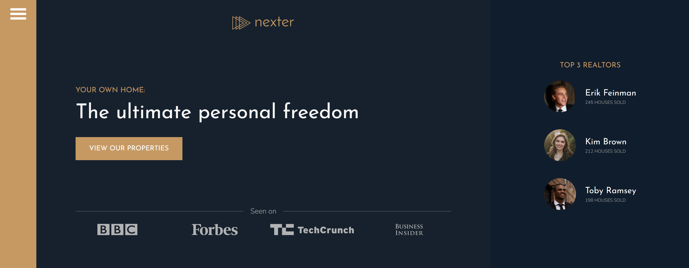
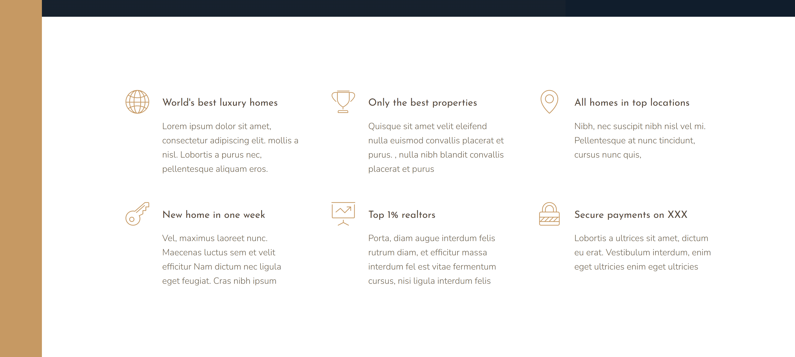
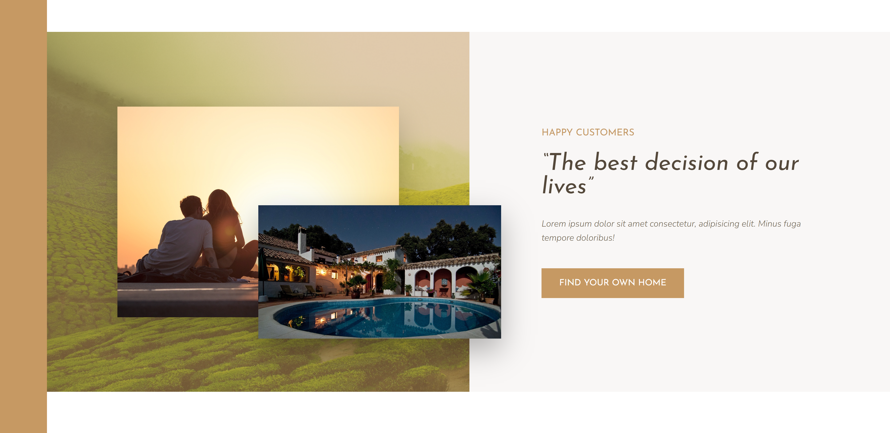
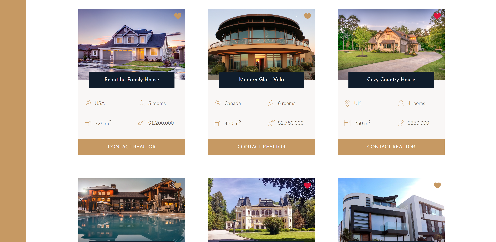
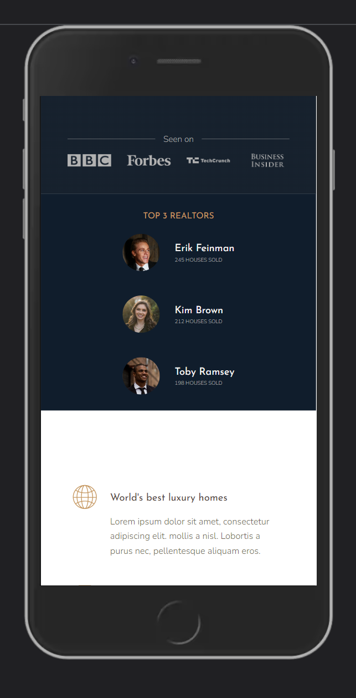

# Nexter

This is a fully responsive web page for a fictional luxury hotel company called 'Nexter'.

## Link

Check it out here: https://nexter-nickm.netlify.app

## Screenshots

 

 

 

 

 

 

## Description

This is the final project in Jonas Schmedtmann's Advanced CSS and SASS course. Although his base website does not utilize a JavaScript library like React, I decided to build it using React and Vite to better understand how to make static websites using React, and to personally witness the benefits and speed of Vite over something like CRA. Using these tools really streamlined the production build process and I believe it will make future additions easier and more straightforward to implement. The focus of this project is CSS Grid, which most of the layouts utilize throughout the page. I added a couple of features to his base website, such as the ability to 'love' or 'heart' a wanted home in the Homes section, and a more robust sidebar for navigation.

## Features

This page features a animated sidebar for navigation and a fully responsive user interface that automatically adapts to the user's screen size. The page contains six main sections: the header and top realtors section, the features section, the stories section, the homes section, a nice gallery, and a footer for more information.

## Technology

React
 
Vite
 
CSS
 
SASS/SCSS
 
Mobile responsiveness
 

## Questions:

Feel free to contact me at mully7773@gmail.com if you have any questions.  
You can view more of my projects at https://github.com/Mully7773.
